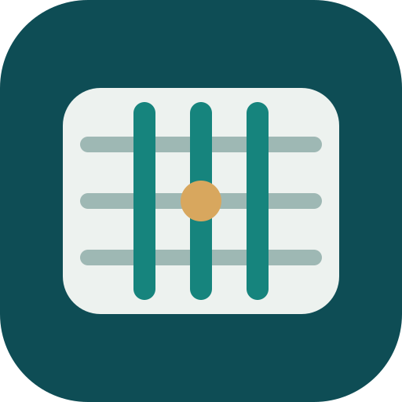
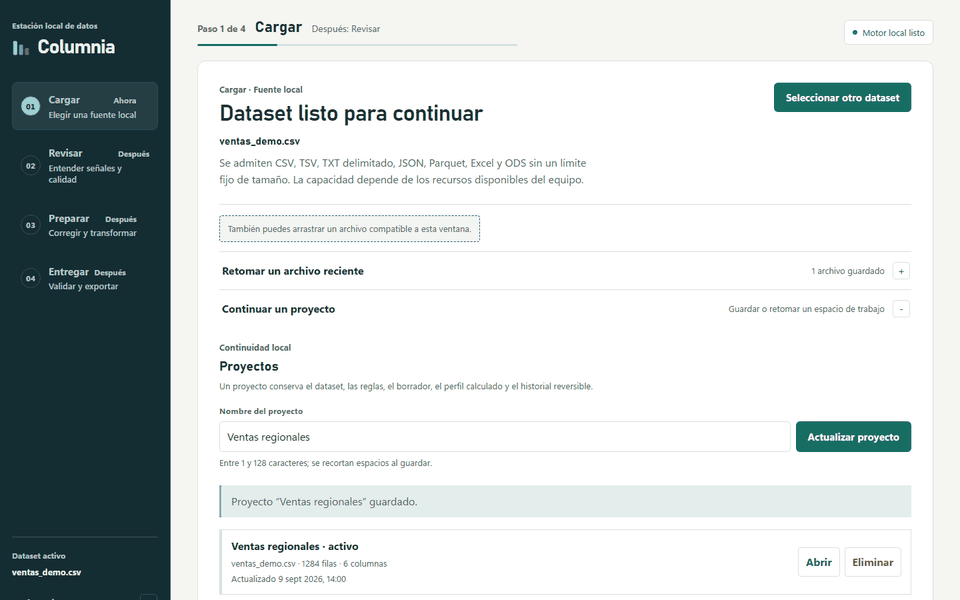
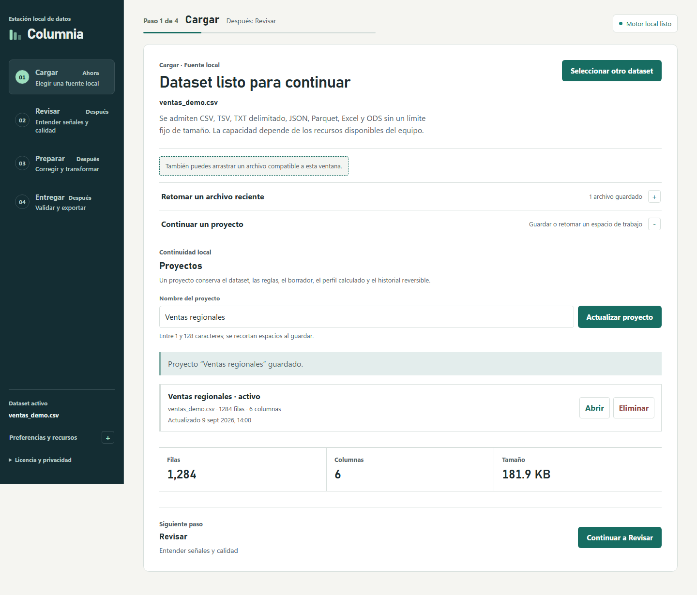
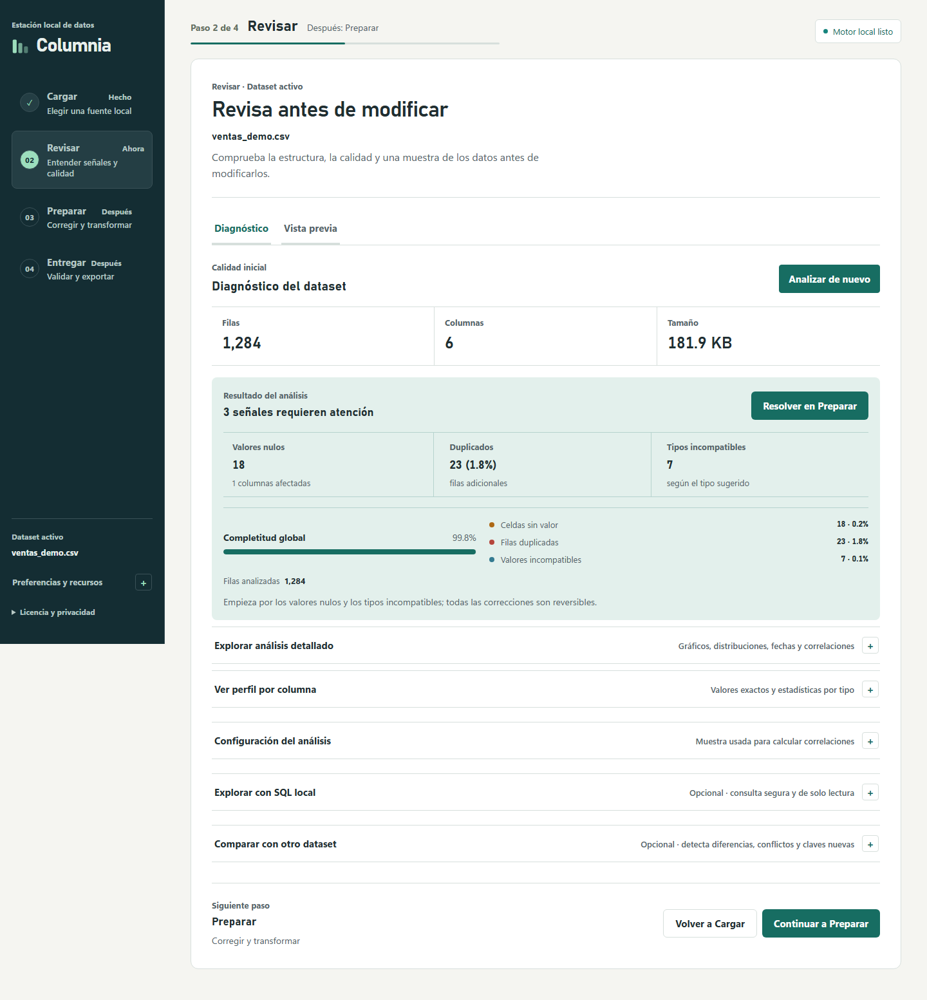
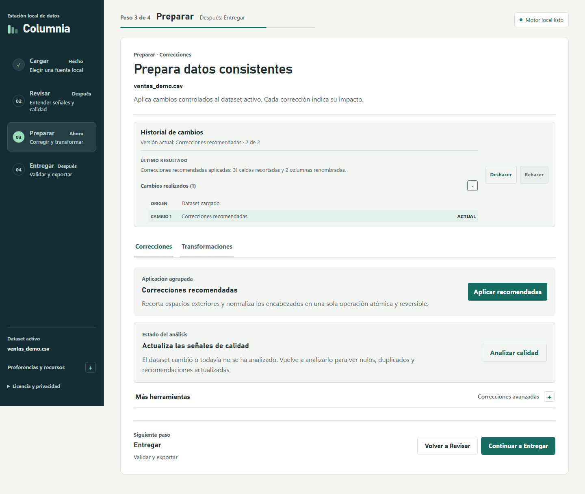
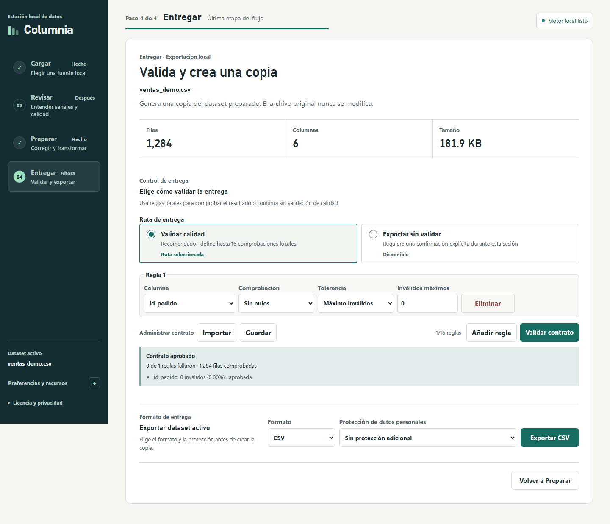
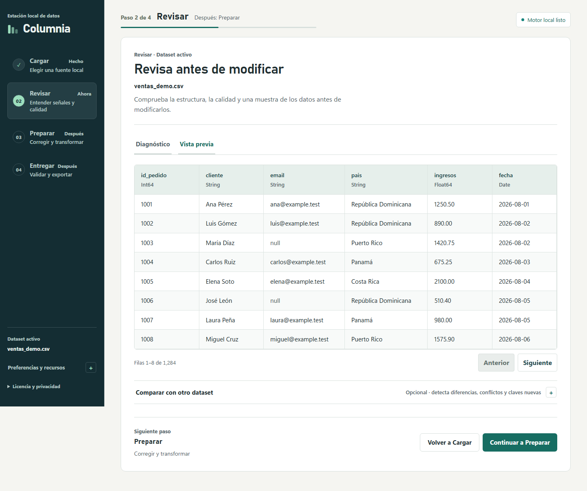
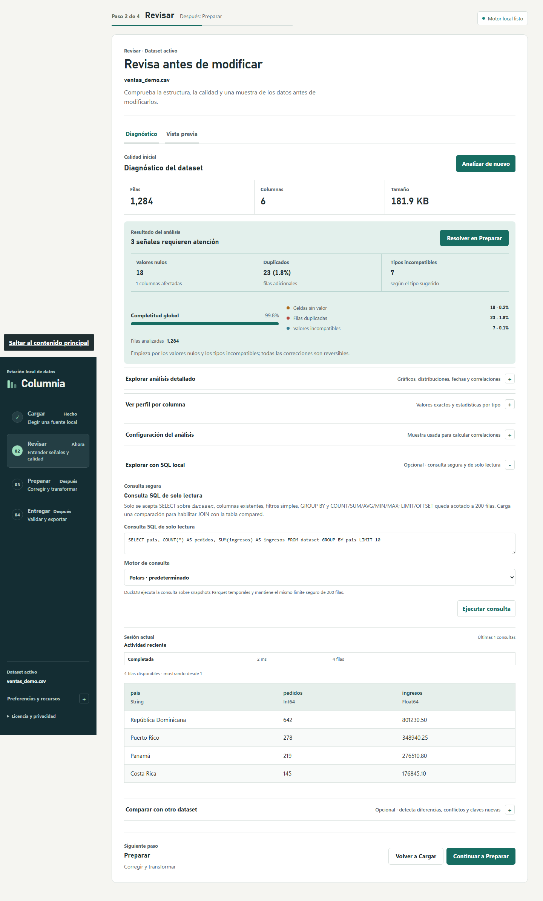

<div align="center">
  
  <h1>Columnia</h1>
  <p><strong>Convierte archivos desordenados en datasets confiables, sin sacar los datos de tu equipo.</strong></p>
  <p>Una estación de trabajo local para revisar, limpiar, transformar, validar y exportar datos.</p>

  
  
  
  [](LICENSE)
</div>

> **Estado:** prototipo local verificable. Windows x64 es la plataforma validada; macOS y Linux son objetivos de diseño. La publicación actual contiene código fuente, no instaladores oficiales.



## Qué hace Columnia

- Abre CSV, TSV, JSON, Parquet, Excel y ODS desde tu equipo.
- Detecta nulos, duplicados, tipos incompatibles y otras señales de calidad.
- Aplica correcciones y transformaciones reversibles.
- Permite explorar los datos con SQL local mediante Polars o DuckDB.
- Valida contratos de calidad antes de exportar una copia.
- Guarda proyectos locales para continuar el trabajo después.

## Recorrido visual

### 1. Cargar y guardar el proyecto

Selecciona un dataset, revisa su tamaño y conserva el espacio de trabajo localmente.



### 2. Revisar la calidad

Obtén un diagnóstico claro antes de modificar los datos.



### 3. Preparar sin perder el control

Aplica correcciones agrupadas y usa el historial para deshacer o rehacer cambios.



### 4. Validar y entregar

Define reglas de aceptación, comprueba el contrato y exporta una copia; el original no se modifica.



### Vista previa de los datos



### Consulta SQL local



Las capturas usan datos sintéticos y no contienen información personal ni datos de producción.

## Privacidad por diseño

Columnia funciona localmente: no requiere cuenta, inicio de sesión, telemetría ni sincronización remota. La interfaz está construida con **React y TypeScript**; el shell nativo usa **Tauri 2** y el motor de datos usa **Rust, Polars y DuckDB**.

Consulta el [modelo de amenazas](THREAT_MODEL.md), la [privacidad de red](docs/reference/network-privacy.md) y la [política de seguridad](SECURITY.md) para conocer los controles técnicos.

## Ejecutar desde el código fuente

Requisitos: Node.js 22+, Rust estable y las dependencias de Tauri para Windows.

```bash
npm install
npm run tauri dev
```

Para validar el proyecto:

```bash
npm run check
npm run test
npm run legal:check
```

## Documentación

- [Primer dataset: tutorial paso a paso](docs/tutorials/first-dataset.md)
- [Documentación completa](docs/README.md)
- [Alcance de V1](docs/reference/v1-scope.md)
- [Arquitectura local-first](docs/explanation/local-first-architecture.md)
- [Referencia de la CLI](docs/reference/cli.md)
- [Decisión legal de publicación](docs/reference/legal-distribution-review.md)

## Contribuir

Los reportes de errores y las mejoras son bienvenidos. Lee [CONTRIBUTING.md](CONTRIBUTING.md) antes de enviar cambios y evita incluir datasets, rutas locales, credenciales o información personal.

## Licencia

Código fuente disponible bajo la [Licencia MIT](LICENSE). Las dependencias de terceros conservan sus propias licencias; consulta [THIRD_PARTY_NOTICES.md](THIRD_PARTY_NOTICES.md).
